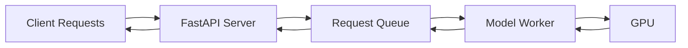

## Introduction

HyperGen provides a production-ready API server that serves diffusion models with an OpenAI-compatible interface. Deploy any diffusers model with request queuing, batching, and authentication.

## Key Features

<CardGroup cols={2}>
  <Card title="OpenAI-Compatible" icon="plug">
    Drop-in replacement for OpenAI's image generation API. Use the official OpenAI Python client.
  </Card>

  <Card title="Request Queue" icon="list">
    Automatic request queuing and batching for optimal GPU utilization.
  </Card>

  <Card title="LoRA Support" icon="sliders">
    Load and serve models with LoRA adapters dynamically.
  </Card>

  <Card title="Authentication" icon="lock">
    Optional API key authentication for secure deployments.
  </Card>

  <Card title="Production-Ready" icon="rocket">
    Built on FastAPI + uvicorn with async request handling.
  </Card>

  <Card title="Easy Deployment" icon="server">
    Single command to start serving any model.
  </Card>
</CardGroup>

## Quick Start

Start a server in one command:

```bash
hypergen serve stabilityai/stable-diffusion-xl-base-1.0
```

Then use it from Python:

```python
from openai import OpenAI

client = OpenAI(
    api_key="not-needed",  # No auth by default
    base_url="http://localhost:8000/v1"
)

response = client.images.generate(
    model="sdxl",
    prompt="A cat holding a sign that says hello world",
    n=1,
    size="1024x1024"
)
```

## Architecture



### Components

<Steps>
  <Step title="API Server">
    FastAPI-based HTTP server that handles incoming requests and responses.

    - OpenAI-compatible endpoints
    - Request validation with Pydantic
    - Authentication middleware
    - Health check endpoints
  </Step>

  <Step title="Request Queue">
    Thread-safe async queue that manages incoming generation requests.

    - FIFO ordering
    - Configurable max size
    - Request tracking with unique IDs
    - Future-based result delivery
  </Step>

  <Step title="Model Worker">
    Background worker that processes requests from the queue.

    - Loads and manages the model
    - Batch processing (future feature)
    - LoRA loading and switching
    - GPU memory management
  </Step>
</Steps>

## OpenAI Compatibility

HyperGen implements OpenAI's image generation API:

### Endpoint: `/v1/images/generations`

Standard OpenAI parameters:

| Parameter | Type | Description |
|-----------|------|-------------|
| `prompt` | string | Text prompt for generation |
| `model` | string | Model identifier (informational) |
| `n` | integer | Number of images (1-10) |
| `size` | string | Image size (e.g., "1024x1024") |
| `response_format` | string | "url" or "b64_json" |

HyperGen extensions:

| Parameter | Type | Default | Description |
|-----------|------|---------|-------------|
| `negative_prompt` | string | None | Negative prompt |
| `num_inference_steps` | integer | 50 | Inference steps (1-150) |
| `guidance_scale` | float | 7.5 | Guidance scale (1.0-20.0) |
| `seed` | integer | None | Random seed for reproducibility |
| `lora_path` | string | None | Path to LoRA weights |
| `lora_scale` | float | 1.0 | LoRA strength (0.0-2.0) |

### Other Endpoints

<AccordionGroup>
  <Accordion title="GET /health">
    Health check endpoint for monitoring.

    **Response:**
    ```json
    {
      "status": "healthy",
      "model": "stabilityai/stable-diffusion-xl-base-1.0",
      "queue_size": 0,
      "device": "cuda"
    }
    ```
  </Accordion>

  <Accordion title="GET /v1/models">
    List available models (OpenAI-compatible).

    **Response:**
    ```json
    {
      "object": "list",
      "data": [
        {
          "id": "stabilityai/stable-diffusion-xl-base-1.0",
          "object": "model",
          "created": 1234567890,
          "owned_by": "hypergen"
        }
      ]
    }
    ```
  </Accordion>
</AccordionGroup>

## Request Flow

1. **Client sends request** to `/v1/images/generations`
2. **Server validates** request parameters
3. **Server checks authentication** (if enabled)
4. **Request added to queue** with unique ID
5. **Worker picks up request** from queue
6. **Model generates images** on GPU
7. **Results returned** to client via async future
8. **Response formatted** as OpenAI-compatible JSON

## Performance

### Single Request Processing

Typical latency (SDXL, 50 steps, RTX 4090):
- Queue time: &lt;10ms
- Generation time: ~3-5 seconds
- Total: ~3-5 seconds

### Queue Management

The request queue handles multiple concurrent requests:

- Requests are processed FIFO (first in, first out)
- Max queue size configurable (default: 100)
- Queue full returns HTTP 503 (Service Unavailable)

### Batch Processing

<Note>
  Batch processing for multiple requests is coming in Phase 2.
</Note>

Future feature:
- Automatically batch compatible requests
- Process multiple prompts in one forward pass
- Configurable max batch size

## Deployment Scenarios

### Local Development

```bash
hypergen serve stabilityai/stable-diffusion-xl-base-1.0
```

No authentication, localhost only.

### Production Deployment

```bash
hypergen serve stabilityai/stable-diffusion-xl-base-1.0 \
  --host 0.0.0.0 \
  --port 8000 \
  --api-key your-secret-key \
  --max-queue-size 100
```

With authentication and external access.

### Behind Reverse Proxy

```bash
# HyperGen server
hypergen serve model_id --host 127.0.0.1 --port 8000

# Nginx config
location /v1/ {
    proxy_pass http://localhost:8000;
    proxy_set_header Host $host;
    proxy_set_header X-Real-IP $remote_addr;
}
```

### Docker Deployment

<Note>
  Official Docker images coming soon.
</Note>

Example Dockerfile:
```dockerfile
FROM nvidia/cuda:12.1.0-runtime-ubuntu22.04

RUN pip install hypergen

CMD ["hypergen", "serve", "stabilityai/stable-diffusion-xl-base-1.0"]
```

## Roadmap

### Phase 1 (Current)

-  FastAPI server with OpenAI endpoints
-  Request queue management
-  Model worker
-  API key authentication
-  LoRA support (server flag)
- =� Complete inference implementation

### Phase 2 (Planned)

- Request batching for multiple prompts
- Dynamic LoRA hot-swapping via API
- Metrics and monitoring endpoints
- Rate limiting
- Streaming responses
- Image-to-image endpoints

### Phase 3 (Future)

- Multi-GPU serving
- Model caching and auto-scaling
- Load balancing across workers
- WebSocket support
- Video generation endpoints

## Monitoring and Debugging

### Health Checks

Check server health:

```bash
curl http://localhost:8000/health
```

### Logging

HyperGen logs to stdout with INFO level by default:

```
2024-01-15 10:30:45 - INFO - Starting HyperGen server...
2024-01-15 10:30:45 - INFO - Model: stabilityai/stable-diffusion-xl-base-1.0
2024-01-15 10:30:50 - INFO - Server ready!
2024-01-15 10:31:00 - INFO - Request abc123 queued (queue size: 1)
```

### Error Handling

The server returns standard HTTP status codes:

- `200 OK` - Success
- `400 Bad Request` - Invalid parameters
- `401 Unauthorized` - Missing/invalid API key
- `500 Internal Server Error` - Generation failed
- `503 Service Unavailable` - Queue full

## Security Considerations

<Warning>
  Always use API keys in production deployments!
</Warning>

**Best Practices:**

1. **Use strong API keys:**
   ```bash
   # Generate a secure key
   openssl rand -hex 32
   ```

2. **Run behind HTTPS:**
   - Use nginx or similar reverse proxy
   - Enable SSL/TLS certificates

3. **Firewall rules:**
   - Restrict access to trusted IPs
   - Use VPN or internal network

4. **Rate limiting:**
   - Use nginx rate limiting
   - Or implement application-level limits

5. **Monitor usage:**
   - Track API usage
   - Alert on anomalies

## Next Steps

<CardGroup cols={2}>
  <Card title="Quick Start" icon="rocket" href="/serving/quickstart">
    Start serving a model in 5 minutes
  </Card>

  <Card title="Configuration" icon="sliders" href="/serving/configuration">
    All server configuration options
  </Card>

  <Card title="Supported Models" icon="list" href="/models/supported">
    See which models you can serve
  </Card>

  <Card title="Examples" icon="code" href="https://github.com/ntegrals/hypergen/tree/main/examples">
    Client examples on GitHub
  </Card>
</CardGroup>
